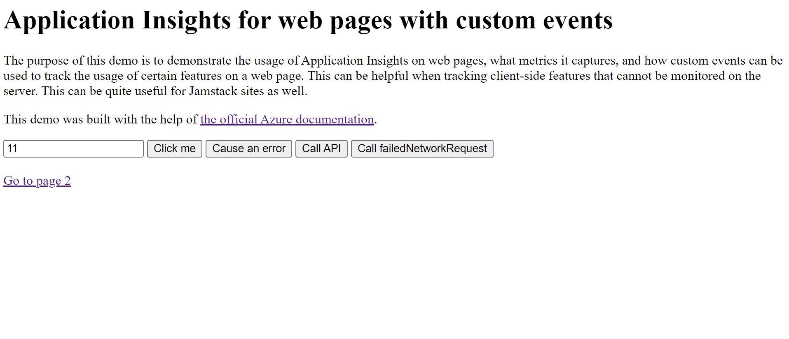
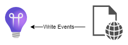
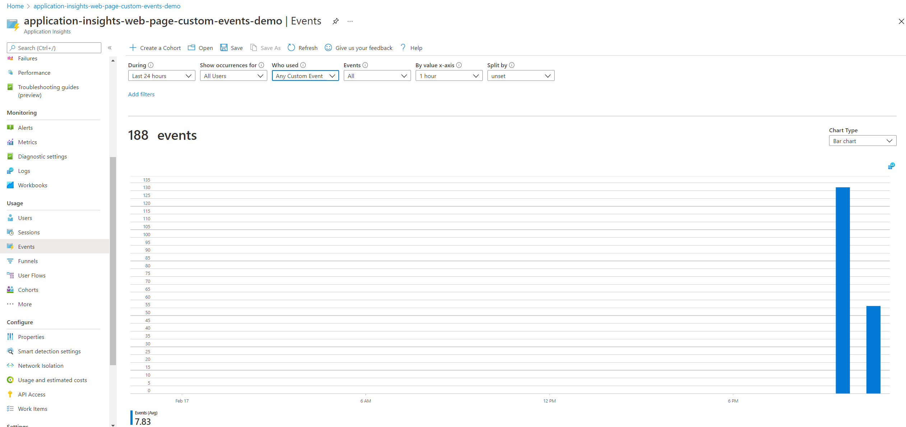
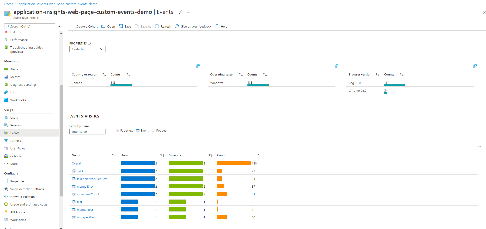
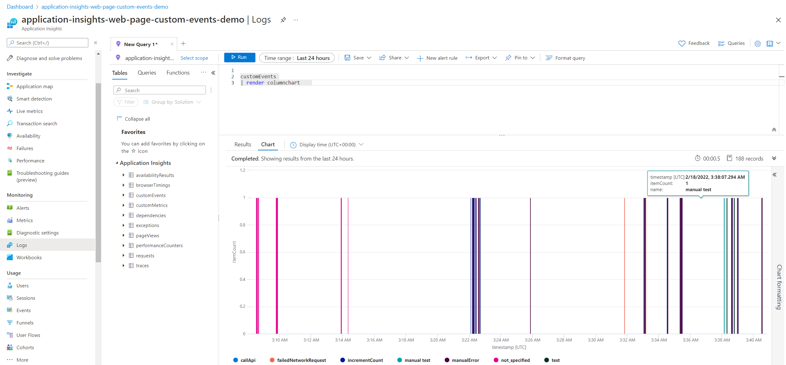

# Application Insights for web pages with custom events

This demo demonstrates the usage of Application Insights on web pages, what metrics it captures, and how custom events can be used to track the usage of certain features on a web page. This can be helpful when tracking client-side features that cannot be monitored on the server. This can be quite useful for Jamstack sites as well.

## How it works

Using the [Javascript library](https://docs.microsoft.com/en-us/azure/azure-monitor/app/javascript), we can send telemetry directly from our web page Javascript. This lets us receive data such as page visits, page visit time, visit path, errors in Javascript, etc. It also allows us to send custom events that could be used to track features.

## How to run this repository

1. Clone the repository locally
2. Enter your instrumentation key in the script in the head tag of both `index.html` and `page2.html`.
3. Start a local server in the root folder of the repository (In my case, I used Python3 by running the following command: `python -m http.server`) (You could also navigate to the file directly, although the link from page2.html to home will fail.)
4. Navigate to the web page and click the buttons. Notice that the tracking events are aggregated so they will be sent off 5-10 seconds later.
5. Consult your Application Insights dashboard, looking at the Logs and the Events tab. The events will take a while to load (5-10 minutes).

## Screenshots 

| | | 
| --- | --- | 
|  |  | 
 |
| --- | --- | --- |

## Security

Regarding the security of the connection string, or in this case the instrumentation key, it is ok to store it in the Javascript code. Usually, this is not recommended because it grants access to the resource, but in this case the instrumentation key only grants write access to the logs. If a malicious actor were to push garbage data to your Application Insights resource, this would hinder your monitoring. However, the privacy and security of your Application Insights resource would be ensured, and they would not be able to read the logs. Note that this is a shortcoming of web page based analytics and this is common of other frontend web analytics solutions.

As noted in [this blog post](https://devblogs.microsoft.com/premier-developer/alternative-way-to-protect-your-application-insights-instrumentation-key-in-javascript/) and supported by [this StackOverflow post](https://stackoverflow.com/questions/27816528/application-insights-security-and-spoofing), this is a limitation of frontend javascript based analytics.

## Resources

This demo was built with the help of [the official Azure documentation](https://docs.microsoft.com/en-us/azure/azure-monitor/app/javascript). Documentation for the appInsights API is found here https://docs.microsoft.com/en-us/azure/azure-monitor/app/api-custom-events-metrics#trackevent. The usage overview is documented here https://docs.microsoft.com/en-us/azure/azure-monitor/app/usage-overview.